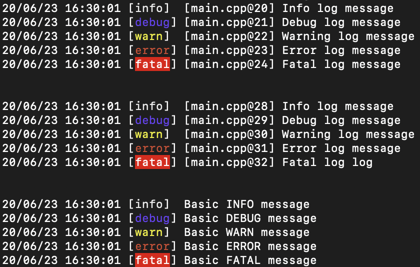

## llog - Simple C++ logger

### Basic Usage
```c++
#include <llog/llog.hpp>

int main() {
    // Basic logs
    llog::info("Basic INFO message");
    llog::debug("Basic DEBUG message");
    llog::warning("Basic WARN message");
    llog::error("Basic ERROR message");
    llog::fatal("Basic FATAL message");
    
    // Macro logs
    LLOG_INFO("Info log message")
    LLOG_DEBUG("Debug log message")
    LLOG_WARN("Warning log message")
    LLOG_ERROR("Error log message")
    LLOG_Fatal("Fatal log message")
    
    // Macro logs w/ positional args
    LLOG_INFO("{} {} {}", "Info", "log", "message")
    LLOG_DEBUG("{0} {1} {2}", "Debug", "log", "message")
    LLOG_WARN("{} {1} {2}", "Warning", "log", "message")
    LLOG_ERROR("{} {} {2}", "Error", "log", "message")
    LLOG_Fatal("{} {1} {}", "Fatal", "log", "message")
    
    return 0;
}
```
#### Output
```
21/06/23 10:05:20 [INFO]  Basic INFO message
21/06/23 10:05:20 [DEBUG] Basic DEBUG message
21/06/23 10:05:20 [WARN]  Basic WARN message
21/06/23 10:05:20 [ERROR] Basic ERROR message
21/06/23 10:05:20 [FATAL] Basic FATAL message


21/06/23 10:05:20 [INFO]  [main.cpp@30] Info log message
21/06/23 10:05:20 [DEBUG] [main.cpp@31] Debug log message
21/06/23 10:05:20 [WARN]  [main.cpp@32] Warning log message
21/06/23 10:05:20 [ERROR] [main.cpp@33] Error log message
21/06/23 10:05:20 [FATAL] [main.cpp@34] Fatal log message


21/06/23 10:05:20 [INFO]  [main.cpp@39] Info log message
21/06/23 10:05:20 [DEBUG] [main.cpp@40] Debug log message
21/06/23 10:05:20 [WARN]  [main.cpp@41] Warning log message
21/06/23 10:05:20 [ERROR] [main.cpp@42] Error log message
21/06/23 10:05:20 [FATAL] [main.cpp@43] Fatal log log
```




### Customization
#### Enabling & Disabling log levels
```c++
llog::Config cfg;

cfg.disableInfoLogLevel();  // Disable INFO level
cfg.disableDebugLogLevel(); // Disable DEBUG level
cfg.disableWarnLogLevel();  // Disable WARN level
cfg.disableErrorLogLevel(); // Disable ERROR level
cfg.disableFatalLogLevel(); // Disable FATAL level

cfg.enableInfoLogLevel();  // Enable INFO level  
cfg.enableDebugLogLevel(); // Enable DEBUG level
cfg.enableWarnLogLevel();  // Enable WARN level
cfg.enableErrorLogLevel(); // Enable ERROR level
cfg.enableFatalLogLevel(); // Enable FATAL level

llog::setLoggerConfig(cfg); // Set the loggers config
```

### Stopwatch
```c++
#include <llog/llog.hpp>
#include <thread>

int main() {
    llog::StopWatch sw;
    std::this_thread::sleep_for(std::chrono::seconds(3));
    
    LLOG_DEBUG("Time elapsed: {}μs", sw.elapsedMicroseconds())
    LLOG_DEBUG("Time elapsed: {}ms", sw.elapsedMilliseconds())
    LLOG_DEBUG("Time elapsed: {}s", sw.elapsedSeconds())
    
    return 0;
}
```

#### Output
```
21/06/23 14:44:07 [DEBUG] [main.cpp@49] Time elapsed: 3005058μs
21/06/23 14:44:07 [DEBUG] [main.cpp@50] Time elapsed: 3005ms
21/06/23 14:44:07 [DEBUG] [main.cpp@51] Time elapsed: 3s
```